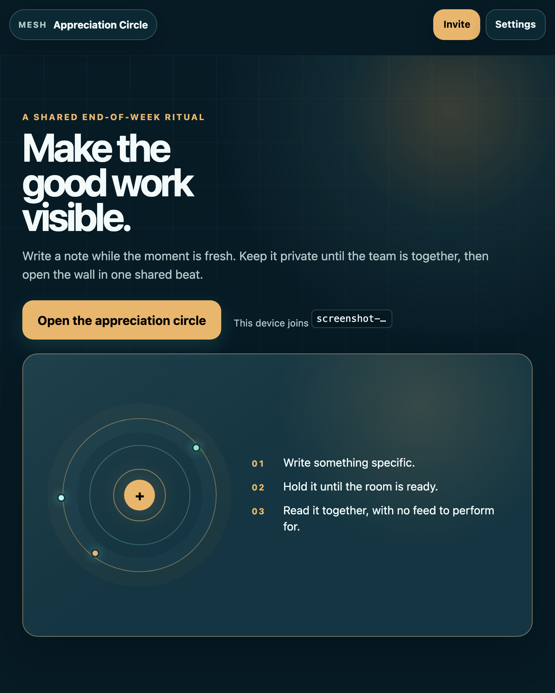
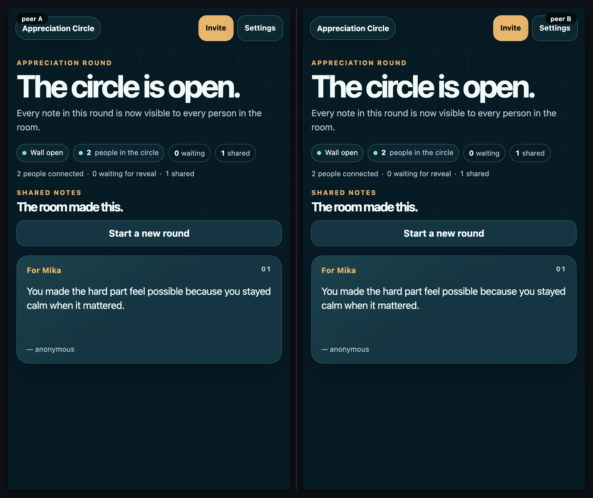

# Appreciation Circle

[](https://baditaflorin.github.io/mesh-applause/)
[](https://github.com/baditaflorin/mesh-applause/blob/main/package.json)
[](LICENSE)
[](docs/adr/0001-deployment-mode.md)

> A peer-to-peer appreciation ritual for teams: write a private note while the moment is fresh, then reveal the room's thanks together.

**Live:** https://baditaflorin.github.io/mesh-applause/





Open the link on every team phone. Add teammates to the shared roster, write a note, and hold it until the group is ready. One person taps **Reveal the wall**; the same phase and cards reach every connected peer.

## The shared ritual

- The first action deliberately opens the circle—no room is silently created at page load.
- Every phone joins one shared **Yjs document** over **y-webrtc** via the [self-hosted signaling server](https://github.com/baditaflorin/signaling-server).
- Team roster is a shared `Y.Array<string>("roster")` — anyone can add or remove names from the Settings drawer.
- Notes are a `Y.Array<{id, to, text, from?, ts, revealed}>("notes")`. Holding a note appends it with `revealed: false`; the compose surface keeps that text out of sight.
- Wall state is a `Y.Map<"current", {phase: "compose"|"revealed"}>("state")` singleton. **Reveal the wall** flips every note and the phase in one CRDT transaction.
- Signing is opt-in. The "from" field is freeform text from the sender's localStorage — no verification, social trust handles it.
- Presence is sourced from y-webrtc's actual WebRTC and BroadcastChannel peer sets, so two local tabs and remote devices receive the same connection accounting.

## Privacy threat model

See [docs/privacy.md](docs/privacy.md). **Pre-reveal notes are CRDT-visible** — the wall UI hides them, but a determined peer can read the Yjs document. Acceptable for team kudos; not acceptable for confidential messages.

## Architecture

- **Mode A** — pure GitHub Pages, zero backend at runtime. ([ADR 0001](docs/adr/0001-deployment-mode.md))
- **WebRTC transport** — Yjs + y-webrtc with self-hosted signaling and TURN.
- **No GitHub Actions** — `docs/` is committed directly. The repository uses Woodpecker for formatting, types, the serial browser suite, security audit, short leak check, and Pages build verification.

## Run it locally

```bash
git clone https://github.com/baditaflorin/mesh-applause.git
git clone https://github.com/baditaflorin/mesh-common.git
cd mesh-applause
npm ci --prefix ../mesh-common
npm ci
npm run dev
```

`mesh-common` must be a sibling directory because this app intentionally consumes its shared MeshShell and presentation primitives via `file:../mesh-common`.

## Self-hosted infrastructure

| Repo                                                                   | Endpoint                               | Role                        |
| ---------------------------------------------------------------------- | -------------------------------------- | --------------------------- |
| [signaling-server](https://github.com/baditaflorin/signaling-server)   | `wss://turn.0docker.com/ws`            | y-webrtc protocol fan-out   |
| [turn-token-server](https://github.com/baditaflorin/turn-token-server) | `https://turn.0docker.com/credentials` | HMAC TURN creds, 1-hour TTL |
| [coturn-hetzner](https://github.com/baditaflorin/coturn-hetzner)       | `turn:turn.0docker.com:3479`           | TURN relay                  |

Override from the in-app Settings drawer.

## Settings (in-app)

- **Room ID** — phones must share one.
- **My name** — used when you toggle "Sign with my name" on a note. Leave blank to stay anonymous-only.
- **Team roster** — shared list of recipients (add/remove names, replicated to every phone).
- **Clear wall** — hard-deletes every note and returns the room to private drafting (a shared action).
- **Signaling URL** / **TURN credentials URL** — override defaults.

## Verification and release evidence

```bash
npm run fmt:check
npm run typecheck
npm run test
MESH_RUN_LEAK_TEST=1 MESH_LEAK_DURATION_MS=5000 npm run test:leak
npm run audit:security
npm audit
```

`tests/e2e/feature.spec.ts` is the load-bearing two-peer path: roster → held private note → shared reveal. `tests/e2e/visual.spec.ts` asserts the first action remains visible at both 390×844 and 1141×602. The current [security audit](docs/security-audit.md) is generated from 16 shared cryptographic checks.

The committed [two-peer recording](docs/demo.gif) and [side-by-side final frame](docs/preview.png) are regenerated with `npm run demo`.

## ADRs

- [0001 — Deployment mode (Mode A, pure Pages)](docs/adr/0001-deployment-mode.md)
- [0002 — Anonymous-by-default, signed-by-opt-in](docs/adr/0002-anonymous-by-default.md)
- [0003 — Reveal as one event](docs/adr/0003-reveal-as-event.md)
- [0010 — GitHub Pages publishing strategy](docs/adr/0010-pages-publishing.md)

## License

[MIT](LICENSE) © 2026 Florin Badita
